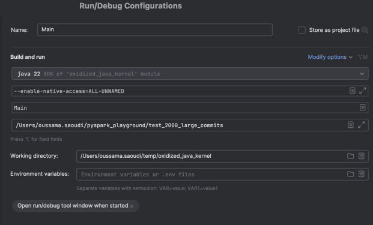

# How to Build
1) Download Intellij
2) `git submodule update --init --recursive` from repository root
3) Run `cargo build  -p delta_kernel_ffi --release --features default-engine` from delta-kernel-rs root
3) In Intellij, download jdk 22 (I use Amazon corretto)
4) Create a new run configuration  for `Main.main`.
5) Add `--enable-native-access=ALL-UNNAMED ` to the JVM options. You can get VM options by clicking on the Modify options button.
6) Add a path to a table in the run configuration ex: `/Users/oussama.saoudi/pyspark_playground/test_2000_large_commits`. You can unzip the `test_2000_commits.zip` from the root repository, and provide a path to that.
7) Run Main.main from inside intellij
8) pray.

The final configuration should look like this: 

