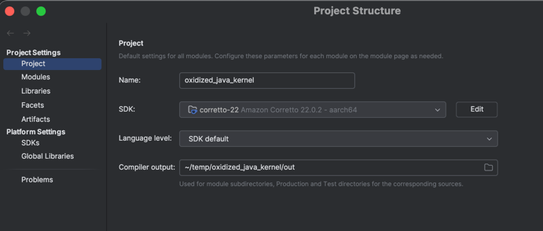
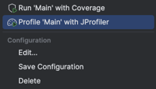

# How to Build

## Prerequisites
- Install [IntelliJ IDEA](https://www.jetbrains.com/idea/download/)
- Install [Rust](https://www.rust-lang.org/) and ensure `cargo` is available
- Install [JDK 22/23](https://aws.amazon.com/corretto/) (Amazon Corretto recommended)


## Steps
1. **Clone the repository and update submodules**
    
    Run the following command from the repository root:
   ```sh
   git submodule update --init --recursive
   ```
2) **Build the Rust components**

    Navigate to the `delta-kernel-rs` root and build with:
    ```sh
    cargo build -p delta_kernel_ffi --release --features default-engine
    ```

3) **Set up IntelliJ IDEA**
   1. Open the project in IntelliJ.
   2. Download and configure JDK 22/23 (Amazon Corretto recommended).
   3. Go to project structure -> project settings. Set the SDK. If it's not there, click edit, then `+`, then download JDK.
   
     


4) **Create a new Run Configuration in IntelliJ**

   1. Navigate to `Run | Edit Configurations`.
   2. Click the + icon and select Application to create a new application configuration.
   3. Name the configuration appropriately, e.g., "Run Main". 
   4. Set the Main class to `Main`. You can use the class search feature (magnifying glass icon) to locate it.
   5. Add `--enable-native-access=ALL-UNNAMED ` to the JVM options. (You can get VM options by clicking on the Modify options button.)
   6. In the Program arguments field, specify the path to the table, for example: 
   `/Users/oussama.saoudi/pyspark_playground/test_2000_large_commits`
      Build and Run the Project:

5) **Ensure** the project compiles without errors by selecting `Build | Build Project`.
6) **Run** the application using the run configuration you created by clicking the Run button or selecting `Run | Run 'Run Main'`.
7) **pray**. 


**The final configuration should look like this:**


For how to use JProfiler:
1) Download JProfiler
2) Download the JProfiler plugin (This may require a restart.). Make sure you are on an updated Intellij, because the plugin can break on older versions.
3) Get license for JProfiler from `go/jprofiler`
4) With the plugin enabled, you should be able to run main with JProfiler attached.


